# **Tagihan Kesehatan**
### _Mengeksplorasi Variabilitas dan Analisis Komprehensif tentang Faktor-faktor yang Mempengaruhi_

## Introduction
Dalam era kesehatan modern, pemahaman mendalam terhadap faktor-faktor yang mempengaruhi tagihan kesehatan menjadi krusial. Analisis ini tidak hanya mencakup berbagai faktor seperti kebiasaan merokok, indeks massa tubuh (BMI), dan jumlah tanggungan anak, tetapi juga mengeksplorasi variabilitas yang ada dalam tagihan kesehatan. Dalam penelitian ini, kita akan memperdalam wawasan tentang bagaimana keputusan sehari-hari, seperti kebiasaan merokok, berhubungan dengan tagihan kesehatan. Selain itu, proyek ini bertujuan untuk memberikan pemahaman yang komprehensif tentang sejauh mana faktor-faktor ini berkontribusi terhadap perbedaan dalam tagihan kesehatan. Melalui analisis yang mendalam, kita berusaha menjawab pertanyaan kritis terkait variabilitas dan pengaruh faktor-faktor tertentu dalam konteks tagihan kesehatan.

> *Sumber [dataset](https://www.google.com/url?q=https://drive.google.com/uc?export%3Ddownload%26id%3D11cQ8CxIhBmajxVOlGCPH98x4sAIwKIeJ&sa=D&source=apps-viewer-frontend&ust=1704510678622707&usg=AOvVaw2ir3M7D6SYiMpzE1JrpZ2F&hl=en)*

## Research Question
### 1. Analisa Descriptive Statistic

1. Berapa rata rata umur pada dataset
2. Berapa rata rata nilai BMI dari yang merokok
3. Apakah variansi dari tagihan kesehatan perokok dan non perokok sama
4. Apakah rata rata umur perempuan dan laki-laki yang merokok sama
5. Mana yang lebih tinggi, rata rata tagihan kesehatan perokok atau non merokok
6. Mana yang lebih tinggi, rata rata tagihan kesehatan perokok yang BMI nya diatas 25 atau non perokok yang BMI nya diatas 25 (overweight)
7. BMI mana yang lebih tinggi, seseorang perokok atau non perokok

### 2. Analisa Variabel Diskrit

1. Gender mana yang memiliki tagihan paling tinggi
2. Distribusi peluang tagihan di tiap-tiap region
3. Apakah setiap region memiliki proporsi data banyak orang yang sama
4. Mana yang lebih tinggi proporsi perokok atau non perokok
5. Berapa peluang seseorang tersebut adalah perempuan diketahui dia adalah perokok
6. Berapa peluang seseorang tersebut adalah laki-laki diketahui dia adalah perokok
7. Bagaimana bentuk distribusi peluang besar tagihan dari tiap-tiap region

### 3. Analisa Variabel Kontinu

1. Mana yang lebih mungkin terjadi:

    - Seseorang dengan BMI diatas 25 mendapatkan tagihan kesehatan diatas 16.7k, atau
    - Seseorang dengan BMI dibawah 25 mendapatkan tagihan kesehatan diatas 16.7k

2. Mana yang lebih mungkin terjadi:

    - Seseorang perokok dengan BMI diatas 25 mendapatkan tagihan kesehatan diatas 16.7k, atau
    - Seseorang non perokok dengan BMI diatas 25 mendapatkan tagihan kesehatan diatas 16.7k

### 4. Analisa Korelasi Variabel
1. Korelasi tagihan kesehatan dengan BMI
2. Korelasi tagihan kesehatan dengan tanggungan anak

### 5. Pengujian Hipotesis

1. Tagihan kesehatan perokok lebih tinggi daripada tagihan kesehatan non perokok
2. Variansi tagihan kesehatan perokok dan non perokok sama
3. Tagihan kesehatan dengan BMI diatas 25 lebih tinggi daripada tagihan kesehatan dengan BMI dibawah 25

## Alur Pengerjaan Project 
1. Dataset
    - Accessing dataset
    - Load dataset
    - Create dataframe
2. Exploration and Processing
    - NaN identification
    - Outlier identification
    - Identify inconsistent format
    - Identify duplicate data
    - Other checks required
3. Explorating Data and Analysis

## _*Mari kita mulai pengerjaan projectnya*_

## 1. Dataset
  - Akses, Load dan Create Dataframe
  
        # Import library yang dibutuhkan
        import pandas as pd  # Library untuk manipulasi data menggunakan DataFrame
        import matplotlib.pyplot as plt  # Library untuk visualisasi data
        import numpy as np  # Library untuk operasi numerik
        import seaborn as sns  # Library untuk visualisasi data statistik
        
        import warnings
        warnings.filterwarnings("ignore")  # Mematikan peringatan agar tidak muncul pada output

        # Deklarasi variable df untuk membaca file insurance.csv
        df = pd.read_csv('insurance.csv')

        # Overview dataframe
        df.head()  # Menampilkan 5 baris pertama dari dataframe untuk mendapatkan gambaran awal

    tampilkan img overview df

        # Overview info dataframe
        # Untuk melihat lebih jauh tipe-tipe data pada setiap kolom
        df.info()  # Menampilkan informasi singkat tentang struktur dataframe, termasuk tipe data dan jumlah nilai non-null

    tampilkan df.info

## 2. Exploration and Processing
  - Identifikasi Nilai NaN (missing value)

        # Cek nilai NaN pada dataframe
        df.isna().sum()  # Menampilkan jumlah nilai NaN (missing values) untuk setiap kolom
    Tampilkan df.info
    Terlihat tidak ada nilai kosong (NaN) pada dataframe

  - Identifikasi Nilai Duplikat

        # Cek nilai duplikat pada dataframe
        df[df.duplicated(keep=False)]  # Menampilkan baris yang merupakan duplikat, dengan menandai semua entri duplikat

      tampilkan nilai duplikat
      - Terlihat ada 2 baris data dengan nilai yang sama, kita asumsikan hal ini adalah nilai duplikat
      - Maka kita hapus baris terakhir pada baris tersebut

            # Hapus nilai duplikat
            # Dengan pengecualian nilai awal
            df = df.drop_duplicates(keep='first').reset_index(drop=True)  # Menghapus duplikat dan mengatur ulang indeks

  ## 3. Explorating Data Analyst
  
  ### 3.1 Analisa Descriptive Statistic
  
  - Berapa rata rata umur pada dataframe
  
        # Hitung rata-rata umur pada dataframe
        avg_umur = df['age'].mean()
        print(f'Rata-rata umur: {avg_umur:.2f} tahun')

        # Visualisasi rata-rata umur menggunakan boxplot
        sns.set_theme()
        plt.figure(figsize=(10, 6))
        sns.boxplot(x=df['age'])
        plt.axvline(avg_umur, color='red', linestyle='dashed', linewidth=2, label=f'Rata-rata umur: {avg_umur:.2f}')
        plt.title('Distribusi Rata-rata Umur')
        plt.xlabel('Umur (tahun)')
        plt.legend()
        plt.show()

    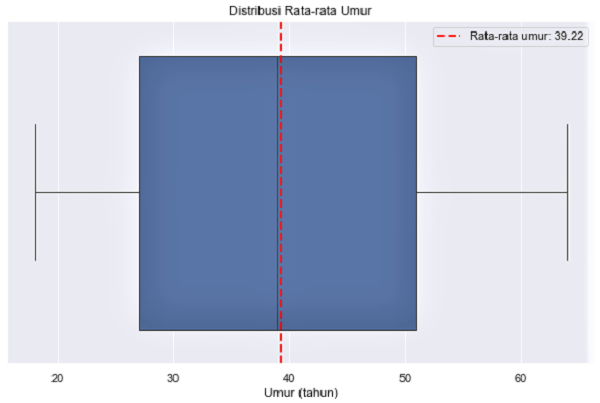
    
    :pushpin:Terlihat rata-rata umur pada dataframe adalah: 39.22 tahun

  - Berapa rata rata nilai BMI dari yang merokok

        # Hitung nilai rata-rata BMI yang perokok
        avg_bmi_smoker = df[df['smoker'] == 'yes']['bmi'].mean()
        
        print(f'Rata-rata BMI yang perokok: {avg_bmi_smoker:.2f}')

        # Visualisasi BMI Perokok menggunakan boxplot
        plt.figure(figsize=(10, 6))
        sns.boxplot(x=df['bmi'])
        plt.axvline(avg_bmi_smoker, color='red', linestyle='dashed',
                    linewidth=2,
                    label=f'Rata-rata BMI Perokok: {avg_bmi_smoker:.2f}')
        plt.title('Distribusi Rata-rata BMI Perokok')
        plt.xlabel('BMI')
        plt.legend()
        plt.show()

    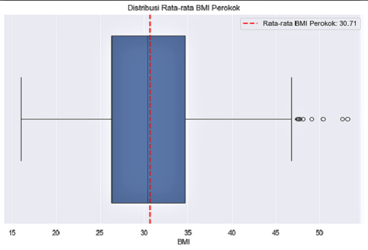

    :pushpin:Terlihat rata-rata BMI yang merokok adalah: 30.71

  - Apakah variansi dari tagihan kesehatan perokok dan non perokok sama?

        # Hitung variansi tagihan kesehatan yang perokok
        variansi_tagihan_smoker = df[df['smoker'] == 'yes']['charges'].var()
        
        # Hitung variansi tagihan kesehatan yang non perokok
        variansi_tagihan_non_smoker = df[df['smoker'] == 'no']['charges'].var()

        # Visualisasi Variansi tagihan kesehatan perokok dan non perokok
        plt.figure(figsize=(10, 6))
        plot = sns.barplot(x=['Perokok', 'Non Perokok'],
                            y=[variansi_tagihan_smoker, variansi_tagihan_non_smoker],
                            palette=['grey', 'green'])
        
        for i, value in enumerate([variansi_tagihan_smoker, variansi_tagihan_non_smoker]):
            plot.text(i, value + 0.2, f'{value:.2f}', ha='center', va='bottom', color='black', fontsize=10)
        
        plt.title('Variansi Tagihan Kesehatan Perokok & Non Perokok')
        plt.ylabel('Variansi')
        plt.show()
        
        # Print variansi tagihan kesehatan perokok dan non perokok
        print(f'Variansi tagihan untuk perokok       : {variansi_tagihan_smoker:.2f}') # dibulatkan 2 angka dibelakang koma
        print(f'Variansi tagihan untuk non perokok   : {variansi_tagihan_non_smoker:.2f}') # dibulatkan 2 angka dibelakang koma

    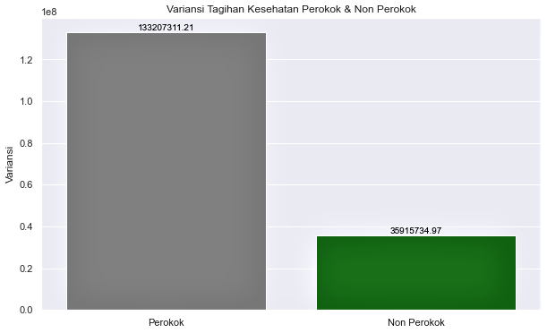

    :pushpin:Terlihat rata-rata Variansi tagihan perokok lebih besar dibanding non perokok yaitu 133207311.21 berbanding 35925420.50

 - Apakah rata rata umur perempuan dan laki-laki yang merokok sama?

        # Menghitutng rata-rata umur Pria Perokok
        avg_age_male_smoker = df[(df['smoker'] == 'yes') & (df['sex'] == 'male')]['age'].mean()
        
        # Menghitung rata-rata umur Wanita Perokok
        avg_age_female_smoker = df[(df['smoker'] == 'yes') & (df['sex'] == 'female')]['age'].mean()

        # Visualisasi rata-rata umur untuk Wanita Perokok dan Pria Perokok
        
        plt.figure(figsize=(10, 6))
        plot = sns.barplot(x=['Wanita Perokok', 'Pria Perokok'],
                           y=[avg_age_female_smoker, avg_age_male_smoker],
                           palette=['lightcoral', 'blue'])
        
        for i, value in enumerate([avg_age_female_smoker, avg_age_male_smoker]):
            plot.text(i, value + 0.2, f'{value:.2f}', ha='center', va='bottom', color='black', fontsize=10)
        
        plt.title('Rata-rata Umur untuk Wanita Perokok dan Pria Perokok')
        plt.ylabel('Umur (tahun)')
        plt.show()
        
        # Tampilkan hasil perhitungan rata-rata Pria dan Wanita Perokok
        print(f'Rata-rata umur pria perokok  : {avg_age_male_smoker:.2f}')
        print(f'Rata-rata umur wanita perokok: {avg_age_female_smoker:.2f}')

   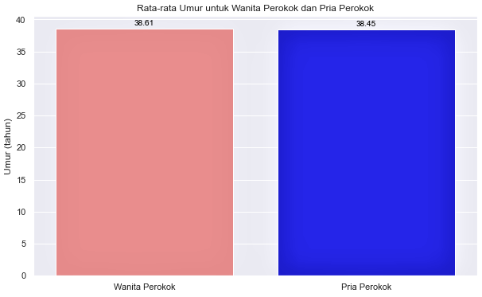

   :pushpin:Terlihat hasil perhitungan rata-rata umur pria perokok sebesar 38.45 tahun dan rata-rata umur wanita perokok sebesar 38.61 tahun, perbedaannya cukup kecil. Perbedaan ini hanya sekitar 0.16 tahun
   
   :pushpin:Dalam konteks ini, dapat disimpulkan bahwa _tidak ada perbedaan umur yang signifikan_ antara pria perokok dan wanita perokok berdasarkan rata-rata umur

- Mana yang lebih tinggi, rata rata tagihan kesehatan perokok atau non merokok

        # Hitung rata-rata tagihan kesehatan perokok
        avg_charges_smoker =  df[df['smoker'] == 'yes']['charges'].mean()
        
        # Hitung rata-rata tagihan kesehatan non perokok
        avg_charges_non_smoker = df[df['smoker'] == 'no']['charges'].mean()

        # Visualisasi rata-rata tagihan kesehatan untuk perokok dan non perokok
        plt.figure(figsize=(10, 6))
        plot = sns.barplot(x=['Perokok', 'Non Perokok'],
                          y=[avg_charges_smoker, avg_charges_non_smoker],
                          palette=['grey', 'blue'])
        
        for i, value in enumerate([avg_charges_smoker, avg_charges_non_smoker]):
            plot.text(i, value + 0.2, f'{value:.2f}', ha='center', va='bottom', color='black', fontsize=10)
        
        plt.title('Rata-rata Tagihan untuk Perokok & Non Perokok')
        plt.ylabel('Tagihan')
        plt.show()
        
        # Tampilkan hitungan rata-rata tagihan kesehatan perokok dan non perokok
        print(f'Rata-rata tagihan kesehatan perokok     : {avg_charges_smoker:.2f}')
        print(f'Rata-rata tagihan kesehatan non perokok : {avg_charges_non_smoker:.2f}')

  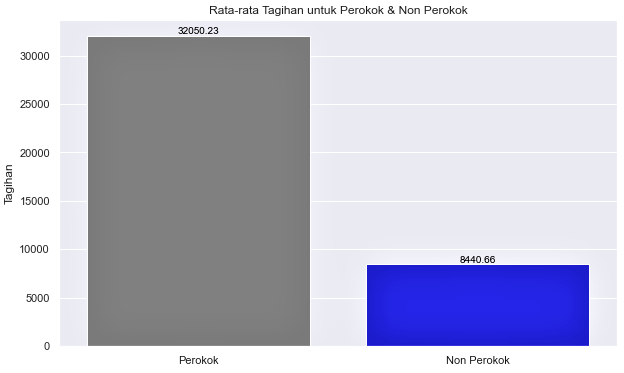

  :pushpin:Terlihat rata-rata tagihan perokok sebesar 32050.23 dan rata-rata tagihan non perokok sebesar 8440.66
  
  :pushpin:Dalam konteks ini dapat disimpulkan bahwa rata-rata tagihan perokok jauh lebih besar dari rata-rata tagihan non perokok

- Mana yang lebih tinggi, rata rata tagihan kesehatan perokok yang BMI nya diatas 25 atau non perokok yang BMI nya diatas 25 (overweight)

        # Hitung rata-rata tagihan kesehatan perokok yang BMI nya diatas 25
        avg_charges_smoker_bmi25 =  df[(df['smoker'] == 'yes') & (df['bmi'] > 25)][['charges']].mean()[0]
        
        # Hitung rata-rata tagihan kesehatan non perokok yang BMI nya diatas 25
        avg_charges_non_smoker_bmi25 =  df[(df['smoker'] == 'no') & (df['bmi'] > 25)][['charges']].mean()[0]

        # Visualisasi rata-rata tagihan kesehatan untuk perokok dan non perokok yang BMI nya di atas 25
        plt.figure(figsize=(10, 6))
        plot = sns.barplot(x=['Perokok', 'Non Perokok'],
                          y=[avg_charges_smoker_bmi25,
                          avg_charges_non_smoker_bmi25],
                          palette=['grey', 'lightskyblue'])
        
        for i, value in enumerate([avg_charges_smoker_bmi25, avg_charges_non_smoker_bmi25]):
            plot.text(i, value + 0.2, f'{value:.2f}', ha='center', va='bottom', color='black', fontsize=10)
        
        plt.title('Rata-rata Tagihan Perokok & Non Perokok untuk BMI diatas 25')
        plt.ylabel('Tagihan Kesehatan')
        plt.show()
        
        # Tampilkan rata-rata tagihan perokok dan nonnn perokok yang BMI diatas 25
        print('Rata-rata tagihan kesehatan perokok yang BMI diatas 25       :', round(avg_charges_smoker_bmi25, 2))
        print('Rata-rata tagihan kesehatan non perokok yang BMI diatas 25   :', round (avg_charges_non_smoker_bmi25, 2))

  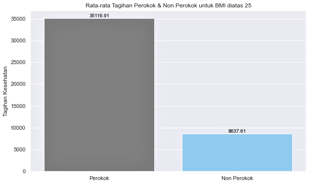

  :pushpin:Terlihat rata-rata tagihan perokok yang BMI nya diatas 25 sebesar 35116.91 dan rata-rata tagihan non perokok yang BMI  nya diatas 25 sebesar 8637.61
  
  :pushpin:Dalam konteks ini dapat disimpulkan bahwa rata-rata tagihan perokok yang BMI nya diatas 25 jauh lebih besar dari rata-rata tagihan non perokok yang BMI nya diatas 25

- BMI mana yang lebih tinggi, seseorang perokok atau non perokok

        # Hitung rata-rata BMI perokok
        avg_bmi_smoker = df[df['smoker'] == 'yes']['bmi'].mean()
        
        # Hitung rata-rata BMI non perokok
        avg_bmi_non_smoker = df[df['smoker'] == 'no']['bmi'].mean()

        # Visualisasi rata-rata BMI untuk perokok dan non perokok
        plt.figure(figsize=(10, 6))
        plot = sns.barplot(x=['Perokok', 'Non Perokok'], y=[avg_bmi_smoker, avg_bmi_non_smoker], palette=['grey', 'blue'])
        
        for i, value in enumerate([avg_bmi_smoker, avg_bmi_non_smoker]):
            plot.text(i, value + 0.2, f'{value:.2f}', ha='center', va='bottom', color='black', fontsize=10)
        
        plt.title('Rata-rata BMI Perokok & Non Perokok')
        plt.ylabel('Tagihan')
        plt.show()
        
        # Tampilkan rata-rata BMI yang perokok dan non perokok
        print(f'Rata-rata BMI perokok       : {avg_bmi_smoker:.2f}')
        print(f'Rata-rata BMI non perokok   : {avg_bmi_non_smoker:.2f}')

  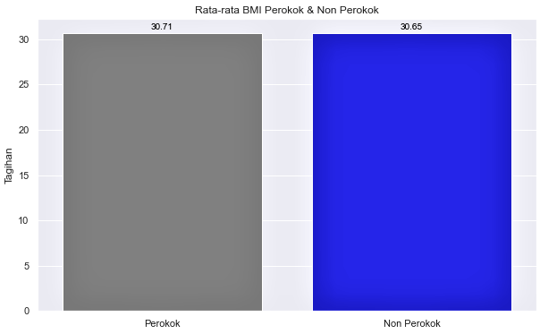

  :pushpin:Terlihat hasil perhitungan rata-rata BMI perokok sebesar 30.71 dan rata-rata BMI non perokok sebesar 30.65, perbedaannya cukup kecil hanya sekitar 0.06
  
  :pushpin:Dalam konteks ini dapat disimpulkan bahwa tidak ada perbedaan yang signifikan antara rata-rata BMI perokok dan BMI non perokok.

### 3.2 Analisa Variabel Diskrit

- Gender mana yang memiliki tagihan paling tinggi

        # Hitung rata-rata tagihan kesehatan untuk setiap gender
        # Female =  Wanita
        # Male = Pria
        avg_charges_by_gender =  df.groupby('sex')['charges'].mean()
        
        avg_charges_by_gender

        # Hitung gender mana dengan tagihan kesehatan yang paling tinggi menggunakan fungsi .idmax()
        # Female =  Wanita
        # Male = Pria
        gender_highest_charges =  avg_charges_by_gender.idxmax(0)

        # Visualisasi rata-rata tagihan kesehatan untuk setiap gender
        avg_charges_by_gender =  df.groupby('sex')['charges'].mean().reset_index()
        colors = {'male': 'blue', 'female': 'pink'}
        plt.figure(figsize=(10, 6))
        plot = sns.barplot(x='sex', y='charges', data=avg_charges_by_gender, palette=avg_charges_by_gender['sex'].map(colors).unique())
        for i, value in enumerate(avg_charges_by_gender['charges']):
            plot.text(i, value + 50, f'{value:.2f}', ha='center', va='bottom', color='black', fontsize=10)
        
        plt.title('Rata-rata Tagihan Kesehatan Berdasarkan Jenis Kelamin')
        plt.ylabel('Tagihan Kesehatan')
        plt.xlabel('Jenis Kelamin')
        plt.show()
        
        # Tampilkan gender dengan nilai rata-rata tagihan kesehatan tertinggi
        print(f'Gender dengan tagihan kesehatan tertinggi adalah: {gender_highest_charges}')

  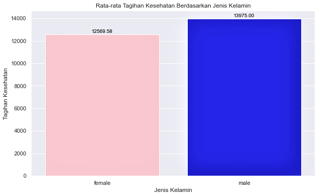

  :pushpin:Terlihat hasil perhitungan rata-rata tagihan kesehatan wanita sebesar 12569.58 dan rata-rata tagihan kesehatan pria sebesar 13975.00, perbedaannya cukup kecil hanya sekitar 1405.42
  
  :pushpin:Dalam konteks ini dapat disimpulkan bahwa ada perbedaan rata-rata tagihan dimana rata-rata tagihan kesehatan Pria lebih besar dibanding Wanita

- Distribusi peluang tagihan di tiap-tiap region

        # Visualisasi Distribusi Tagihan tiap-tiap Region
        plt.figure(figsize=(10, 6))
        barplot = sns.barplot(x='region', y='charges', data=df, ci=None, palette='viridis')
        
        for p in barplot.patches:
            barplot.annotate(format(p.get_height(), '.2f'), 
                             (p.get_x() + p.get_width() / 2., p.get_height()), 
                             ha = 'center', va = 'bottom', 
                             xytext = (0, 1), 
                             textcoords = 'offset points')
        
        plt.title('Distribusi Tagihan tiap-tiap Region')
        plt.xlabel('Region')
        plt.ylabel('Tagihan Kesehatan')
        plt.show()

  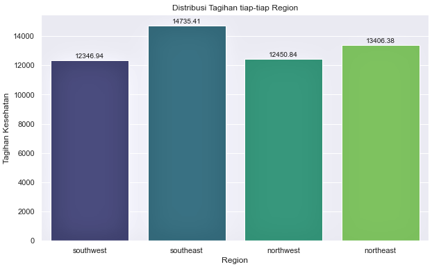

  :pushpin:Terlihat rata-rata Distribusi tagihan tiap-tiap Region
  
  :pushpin: Dalam konteks ini, dapat disimpulkan bahwa Southeast menempati rata-rata distribusi tertinggi yaitu sebesar 14735.41 diikuti oleh Northeast sebesar 13406.38, Northwest sebesar 12450.84 dan Southwest sebesar 12346.94

- Apakah setiap region memiliki proporsi data banyak orang yang sama

        # Menghitung jumlah proporsi banyak orang untuk setiap region
        count_by_region = df['region'].value_counts(normalize=True)

        # Buat Visualisasi proporsi banyak orang di setiap region
        plt.figure(figsize=(10, 6))
        plot = sns.barplot(x=count_by_region.index, y=count_by_region, palette='viridis')
        
        for p in plot.patches:
            plot.annotate(f'{p.get_height():.2%}', (p.get_x() + p.get_width() / 2., p.get_height()),
                          ha='center', va='center', fontsize=10, color='black', xytext=(0, 4),
                          textcoords='offset points')
        
        plt.title('Proporsi Banyak Orang per Region')
        plt.xlabel('Region')
        plt.ylabel('Proporsi')
        plt.show()

  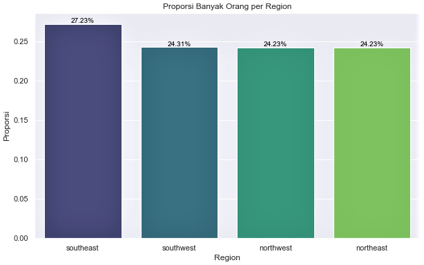

  :pushpin:Terlihat Proporsi banyak orang untuk tiap-tiap Region
  
  :pushpin:Dalam konteks ini dapat disimpulkan bahwa Northwest dan Northeast mempunyai proporsi banyak orang yang sama yaitu 24.33%, sementara proporsi tertinggi ada pada region Southeast 27.23% diikuti dengan Southwest 24.31%

- Mana yang lebih tinggi proporsi perokok atau non perokok

        # Hitung proporsi perokok dan non perokok
        count_by_smoker = df['smoker'].value_counts(normalize=True)

        # Visualisasi Proporsi perokok dan non perokok
        plt.figure(figsize=(8, 6))
        plot = sns.barplot(x=count_by_smoker.index, y=count_by_smoker, palette='viridis')
        
        for p in plot.patches:
            plot.annotate(f'{p.get_height():.2%}', (p.get_x() + p.get_width() / 2., p.get_height()),
                          ha='center', va='center', fontsize=10, color='black', xytext=(0, 5),
                          textcoords='offset points')
            
        plt.title('Proporsi Banyaknya Perokok dan Non Perokok')
        plt.xlabel('Perokok')
        plt.ylabel('Proporsi')    
        plt.show()

  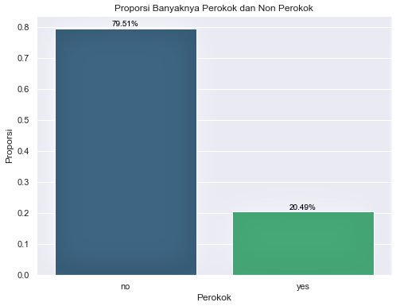

  :pushpin:Terlihat Proporsi banyak orang perokok dan non perokok
  
  :pushpin:Dalam konteks ini dapat disimpulkan bahwa proporsi Non Perokok lebih banyak dibanding Perokok yaitu 79.51% berbanding 20.49%

- Berapa peluang seseorang tersebut adalah perempuan diketahui dia adalah perokok

        # Hitung jumlah perokok perempuan
        perempuan_perokok = df[(df['sex'] == 'female') & (df['smoker'] == 'yes')].shape[0]

        # Hitung peluang perokok perempuan
        # Jumlah perokok perempuan dibagi total perempuan pada df
        prob_perempuan_perokok = perempuan_perokok / len(df)

        # Visualisasi probability perempuan perokok
        sns.set_theme()
        other_count_1 = len(df) - perempuan_perokok # Hitung jumlah kasus yang tidak memenuhi kriteria
        
        # Data untuk pie chart
        labels = ['Perempuan Perokok', 'Lain-lain']
        sizes = [perempuan_perokok, other_count_1]
        colors = ['grey', 'pink']
        
        # Buat pie chart
        plt.figure(figsize=(8, 8))
        plt.pie(sizes, labels=labels, autopct='%1.2f%%', colors=colors, startangle=90)
        plt.title('Probability Perempuan Perokok')
        plt.show()
        
        # Tampilkan probabilitas perokok perempuan
        print('Probabilitas perokok perempuan:', prob_perempuan_perokok)

  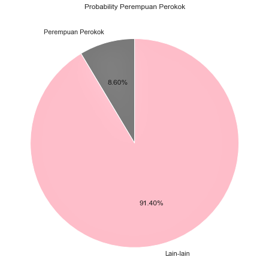

  :pushpin:Terlihat Probability Perempuan Perokok
  
  :pushpin:Dalam konteks ini, dapat disimpulkan bahwa probability seorang peremuan perokok sebesar 8.60% berbanding lain-lain 91.40%

- Berapa peluang seseorang tersebut adalah laki-laki diketahui dia adalah perokok

        # Hitung jumlah perokok Laki-laki 
        pria_perokok = df[(df['sex'] == 'male') & (df['smoker'] == 'yes')].shape[0]

        # Hitung peluang perokok laki-laki
        # Jumlah perokok laki-laki dibagi total laki-laki pada df
        
        prob_pria_perokok = pria_perokok / len(df)

        # Visualisasi probability laki-laki perokok
        
        # Hitung jumlah kasus yang tidak memenuhi kriteria
        other_count_2 = len(df) - pria_perokok 
        
        # Data untuk pie chart
        labels = ['Laki-laki Perokok', 'Lain-lain']
        sizes = [pria_perokok, other_count_2]
        colors = ['grey', 'lightskyblue']
        
        # Buat pie chart
        plt.figure(figsize=(8, 8))
        plt.pie(sizes, labels=labels, autopct='%1.2f%%', colors=colors, startangle=90)
        plt.title('Probability Laki-laki Perokok')
        plt.show()
        
        # Tampilkan probabilitas perokok pria
        print('Probabilitas perokok laki-laki:', prob_pria_perokok)

  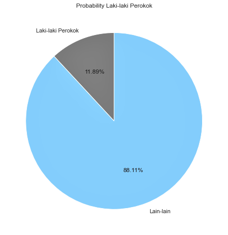

  :pushpin:Terlihat Probability Laki-laki Perokok
  
  :pushpin:Dalam konteks ini dapat disimpulkan bahwa probability seorang laki-laki perokok sebesar 11.89% berbanding lain-lain 88.11%

- Bagaimana bentuk distribusi peluang besar tagihan dari tiap-tiap region

        # Visualisasi distribusi tagihan kesehatan untuk setiap region menggunakan histogram
        fig, axes = plt.subplots(nrows=2, ncols=2, figsize=(14, 10))
        
        sns.histplot(df[df['region'] == 'northeast']['charges'], kde=True, ax=axes[0, 0],
                      color='skyblue').set(xlabel='Tagihan Kesehatan')
                      axes[0, 0].set_title('Northeast')
        
        sns.histplot(df[df['region'] == 'northwest']['charges'], kde=True, ax=axes[0, 1],
                      color='salmon').set(xlabel='Tagihan Kesehatan')
                      axes[0, 1].set_title('Northwest')
        
        sns.histplot(df[df['region'] == 'southeast']['charges'], kde=True, ax=axes[1, 0],
                      color='green').set(xlabel='Tagihan Kesehatan')
                      axes[1, 0].set_title('Southeast')
        
        sns.histplot(df[df['region'] == 'southwest']['charges'], kde=True, ax=axes[1, 1],
                      color='gold').set(xlabel='Tagihan Kesehatan')
                      axes[1, 1].set_title('Southwest')
        
        plt.tight_layout()
        plt.show()

  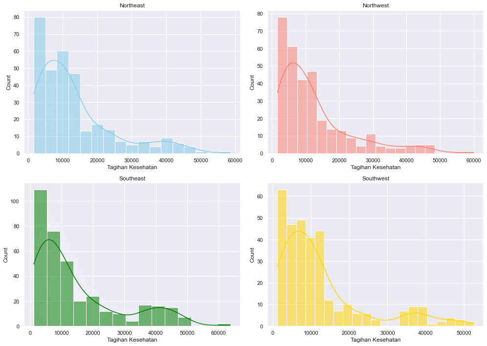

  :pushpin:Terlihat visualisasi distribusi tagihan untuk tiap-tiap region
  
  :pushpin:Dalam konteks ini dapat disimpulkan ke-empat region Northeast, Northwest, Southeast dan Southwest mempunyai distribusi tagihan yang mirip yaitu Positively Skewed Distribution / right-skewed distribution

### 3.3 Analisa Variabel Kontinu

- Mana yang lebih mungkin terjadi
    - Seseorang dengan BMI diatas 25 mendapatkan tagihan kesehatan diatas 16.7k, atau
    - Seseorang dengan BMI dibawah 25 mendapatkan tagihan kesehatan diatas 16.7k

            # Peluang seseorang memiliki BMI di atas 25 dan tagihan kesehatan diatas 16.7k
            prob_bmi_diatas_25_and_charges_diatas_16_7k = len(df[(df['bmi'] > 25) & (df['charges'] > 16700)]) / len(df)
            
            # Peluang seseorang memiliki BMI dibawah 25 dan tagihan kesehatan diatas 16.7k
            prob_bmi_dibawah_25_dan_charges_diatas_16_7k = len(df[(df['bmi'] < 25) & (df['charges'] > 16700)]) / len(df)

            # Visualisasi peluang untuk seseorang yang BMI diatas 25 dan dibawah 25 mendapatkan tagihan diatas 16.7k
            data = {
                'Probabilitas': [prob_bmi_diatas_25_and_charges_diatas_16_7k, prob_bmi_dibawah_25_dan_charges_diatas_16_7k],
                'Kategori': ['BMI > 25 | Tagihan > 16.7k', 'BMI < 25 | Tagihan > 16.7k']
            }
            df_visualisasi = pd.DataFrame(data)
            
            plt.figure(figsize=(8, 6))
            barplot = sns.barplot(x='Kategori', y='Probabilitas', data=df_visualisasi, palette='viridis')
            
            # Menampilkan nilai probabilitas pada setiap bar
            for p in barplot.patches:
                barplot.annotate(format(p.get_height(), '.2%'), 
                                 (p.get_x() + p.get_width() / 2, p.get_height()), 
                                 ha = 'center', va = 'baseline')
            
            # Menambahkan label dan judul
            plt.xlabel('Kategori')
            plt.ylabel('Probabilitas')
            plt.title('Probabilitas untuk Kasus Khusus')
            plt.show()
            
            # Cetak hasil
            print(f"Peluang seseorang yang BMI nya diatas 25 dan tagihan diatas 16.7k   : {prob_bmi_diatas_25_and_charges_diatas_16_7k:.2%}")
            print(f"Peluang seseorang yang BMI nya dibawah 25 dan tagihan diatas 16.7k  : {prob_bmi_dibawah_25_dan_charges_diatas_16_7k:.2%}")

      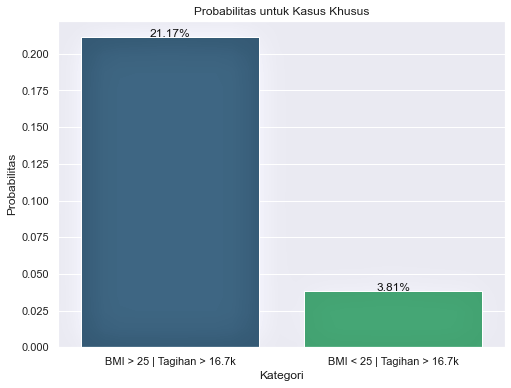

      :pushpin:Terlihat visualisasi untuk tiap-tiap Kategori

      :pushpin:Dalam konteks ini dapat disimpulkan:
      
      - Peluang bahwa seseorang dengan BMI di atas 25 mendapatkan tagihan kesehatan di atas 16.7k adalah 21.17%
      - Peluang bahwa seseorang dengan BMI di bawah 25 mendapatkan tagihan kesehatan di atas 16.7k adalah 3.81%

      :pushpin:Jadi peluang seseorang dengan BMI diatas 25 mendapatkan tagihan diatas 16.7k lebih besar dibanding seseorang dengan BMI dibawah 25

- Mana yang lebih mungkin terjadi
  - Seseorang perokok dengan BMI diatas 25 mendapatkan tagihan kesehatan diatas 16.7k, atau
  - Seseorang non perokok dengan BMI diatas 25 mendapatkan tagihan kesehatan diatas 16.7k
 
        # Perhitungan probabilitas seseorang perokok dengan BMI diatas 25 mendapatkan tagihan diatas 16.7k
        prob_perokok_bmi_diatas_25_dan_tagihan_diatas_16_7k = len(df[(df['smoker'] == 'yes') & (df['bmi'] > 25) & (df['charges'] > 16700)]) / len(df)
        
        # Perhitungan probabilitas seseorang non perokok dengan BMI diatas 25 mendapatkan tagihan diatas 16.7k
        prob_non_perokok_bmi_diatas_25_dan_tagihan_diatas_16_7k = len(df[(df['smoker'] == 'no') & (df['bmi'] > 25) & (df['charges'] > 16700)]) / len(df)

        # Visualisasi probabilitas seseorang perokok dan nonn perokok dengan BNI diatas 25 mendapatkan tagihan diats 16.7k
        
        data = {
            'Probabilitas': [prob_perokok_bmi_diatas_25_dan_tagihan_diatas_16_7k, prob_non_perokok_bmi_diatas_25_dan_tagihan_diatas_16_7k],
            'Kategori': ['Perokok dengan BMI > 25', 'Non-Perokok dengan BMI > 25']
        }
        df_visualisasi = pd.DataFrame(data)
        
        # Membuat visualisasi
        plt.figure(figsize=(10, 6))
        barplot = sns.barplot(x='Kategori', y='Probabilitas', data=df_visualisasi, palette='viridis')
        
        # Menampilkan nilai probabilitas pada setiap bar
        for p in barplot.patches:
            barplot.annotate(format(p.get_height(), '.2%'), 
                             (p.get_x() + p.get_width() / 2, p.get_height()), 
                             ha = 'center', va = 'baseline')
        
        # Menambahkan label dan judul
        plt.xlabel('Kategori')
        plt.ylabel('Probabilitas')
        plt.title('Probabilitas Perokok & Non Perokok dengan BMI > 25 Mendapatkan Tagihan diatas 16.7k')
        plt.show()
        
        # Menampilkan hasil
        print(f"Probabilitas seseorang perokok dengan BMI diatas 25 mendapatkan tagihan diatas 16.7k      : {prob_perokok_bmi_diatas_25_dan_tagihan_diatas_16_7k:.2%}")
        print(f"Probabilitas seseorang non perokok dengan BMI diatas 25 mendapatkan tagihan diatas 16.7k  : {prob_non_perokok_bmi_diatas_25_dan_tagihan_diatas_16_7k:.2%}")

    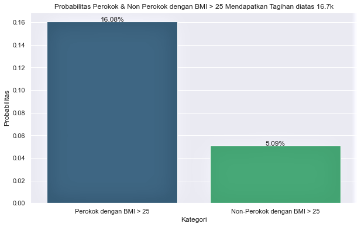

    :pushpin:Terlihat visualisasi untuk tiap-tiap kondisi

    :pushpin:Dalam konteks ini dapat disimpulkan:

    - Peluang seseorang perokok dengan BMI diatas 25 mendapatkan tagihan kesehatan diatas 16.7k adalah 16.08%
    - Peluang seseorang Non-Perokok dengan BMI diatas 25 mendapatkan tagihan kesehatan diatas 16.7k adalah 5.09%

    :pushpin:Jadi peluang seseorang perokok dengan BMI diatas 25 mendapatkan tagihan kesehatan diatas 16.7k lebih besar dibanding non perokok

### 3.4 Analisa Korelasi Variabel

- Korelasi antara tagihan kesehatan dengan BMI

        # Mengecek korelasi antara Tagihan dan BMI dengan fungsi .corr
        corr_charges_bmi = df['charges'].corr(df['bmi'])

        # Visualisasi korelasi antara Tagihan vs BMI
        
        plt.figure(figsize=(10, 6))
        scatter = sns.regplot(x='bmi', y='charges', data=df, color='blue', scatter_kws={'s': 10})
        
        # Menambahkan trendline dengan warna berbeda
        sns.regplot(x='bmi', y='charges', data=df, scatter=False, ax=scatter, color='orange')
        
        # Menampilkan nilai koefisien korelasi yang dibulatkan 2 angka dibelakang koma
        plt.text(15, 60000, f'Korelasi: {corr_charges_bmi:.2f}', fontsize=12, color='red')
        
        plt.title('Korelasi antara Tagihan Kesehatan vs BMI')
        plt.xlabel('BMI')
        plt.ylabel('Tagihan kesehatan')
        plt.show()

  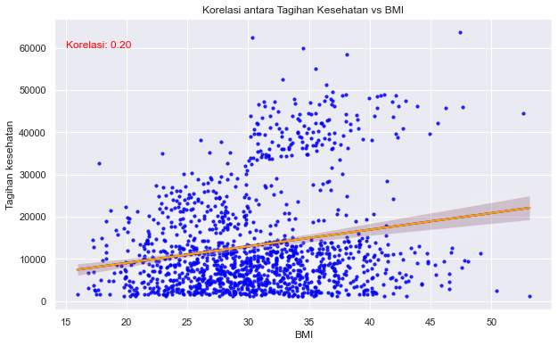

  :pushpin:Dalam konteks ini dapat disimpulkan:

  - Korelasi positif: Menunjukkan bahwa ada hubungan searah yang positif antara dua variabel. Hal ini mengindikasikan bahwa ketika nilai BMI naik, begitu pula dengan tagihan kesehatan
  - Hubungan yang lemah: Meskipun ada hubungan positif tetapi nilai korelasinya rendah (sekitar 0,20). Akibatnya, perubahan nilai BMI hanya berdampak kecil pada perubahan tagihan kesehatan. Korelasi ini tidak cukup untuk membuat perkiraan yang akurat mengenai tagihan kesehatan hanya berdasarkan BMI.

- Korelasi antara tagihan kesehatan dengan tanggungan anak

        # Mengecek korelasi antara Tagihan dan BMI dengan fungsi .corr
        corr_charges_children = df['charges'].corr(df['children'])

        # Visualisasi korelasi antara Tagihan vs Tanggungan anak
        
        # Scatter plot dengan trendline
        sns.lmplot(x='children', y='charges', data=df, line_kws={'color': 'red'})
        plt.text(4, 60000, f'Korelasi: {corr_charges_children:.2f}', fontsize=12, color='red') # Nilai korelasi dibulatkan 2 angka dibelakang koma
        
        # Menambahkan judul dan label sumbu
        plt.title('Korelasi antara Tagihan dan Tanggungan Anak')
        plt.xlabel('Jumlah Anak')
        plt.ylabel('Tagihan Kesehatan')
        plt.show()

  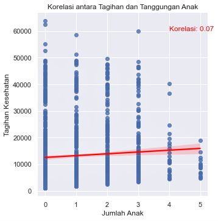

  :pushpin:Dalam konteks ini dapat disimpulkan:

  - Korelasi positif: Menunjukkan bahwa ada hubungan searah yang positif antara dua variabel. Hal ini mengindikasikan bahwa ketika jumlah anak bertambah, begitu pula dengan tagihan kesehatan
  - Hubungan yang lemah: Meskipun ada hubungan positif tetapi nilai korelasinya rendah (sekitar 0,07). Akibatnya, pertambahan jumlah anak hanya berdampak kecil pada perubahan tagihan kesehatan. Korelasi ini tidak cukup untuk membuat perkiraan yang akurat mengenai tagihan kesehatan hanya berdasarkan jumlah anak
 
### 3.5 Pengujian Hipotesis

- Tagihan kesehatan perokok lebih tinggi daripada tagihan kesehatan non perokok

        # Import fungsi yang dibutuhkan
        from scipy.stats import ttest_ind
        
        # Pisahkan data tagihan kesehatan antara perokok dan non-perokok
        charges_perokok = df[df['smoker'] == 'yes']['charges']
        charges_non_perokok = df[df['smoker'] == 'no']['charges']
        
        # Lakukan uji t-test
        t_statistic, p_value = ttest_ind(a=charges_perokok, b=charges_non_perokok, equal_var=False, alternative='two-sided')

        # Visualisasi T-Distribution hipotesis tagihan kesehatan porokok dan non perokok dengan menampikan nilai t-critical dan t-statistic
        from scipy.stats import t
        
        # Hitung degree of freedom
        degree_of_freedom = len(charges_perokok) + len(charges_non_perokok) - 2
        
        # Tingkat signifikansi yang umum: 0.05
        alpha = 0.05
        
        # Hitung critical value untuk alpha = 0.05
        t_crit = t.ppf(alpha, degree_of_freedom)
        
        # Visualisasi T-Distribution
        x = np.linspace(-5, 5, 1000)
        y = t.pdf(x, degree_of_freedom)
        
        plt.figure(figsize=(12, 8))
        
        # Area diatas kurva t-critical
        plt.fill_between(x, y, label=f'T-Distribution', 
                            facecolor='blue',
                            alpha=0.35)
        
        # Area kritis / Are dibawah kurva t-critical
        plt.fill_between(x, y, where=(x < t_crit), 
                         color='red', alpha=0.3, 
                         label=f'T-Critical: {round(t_crit, 2)}')
        
        # Tandai T-Statistic
        # plt.axvline(x=t_statistic, color='green', linestyle='--', label=f'T-Statistic {round(t_statistic, 2)}')
        
        plt.title('Hipotesis - Distribusi-T dengan T-Critical Tagihan kesehatan perokok > non perokok')
        plt.xlabel('Nilai T')
        plt.ylabel('Probability Density Function')
        plt.legend(loc='upper right')
        plt.show()
        
        # Tampilkan hasil uji
        print(f"T-Statistic : {t_statistic}")
        print(f"P-Value     : {p_value:.14f}")
        print(f"T-Critical  : {t_crit}")
        
        # Ambil keputusan berdasarkan p-value
        print("\nPengambilan Keputusan:")
        
        # Jika p_value lebih kecil dari alpha maka:
        if p_value < alpha:
            print("Tolak hipotesis nol (H0).")
            print("Terdapat perbedaan yang signifikan antara tagihan kesehatan perokok dan non-perokok.")
        # Jika p_value lebih besar dari alpha maka:
        else:
            print("Tidak cukup bukti untuk menolak hipotesis nol.")
            print("Tidak ada perbedaan signifikan antara tagihan kesehatan perokok dan non-perokok.")

  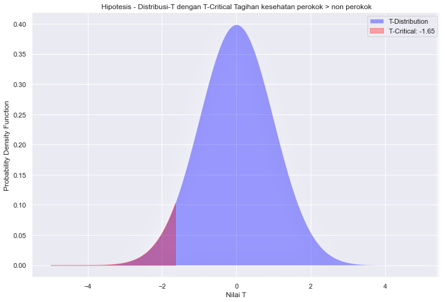

  :pushpin:Pengambilan Keputusan:

  - Tolak hipotesis nol (H0)
  - Terdapat perbedaan yang signifikan antara tagihan kesehatan perokok dan non-perokok

- Variansi tagihan kesehatan perokok dan non perokok sama

        # Fungsi from scipy.stats import f :
        # Ini umumnya disebut sebagai uji perbandingan varians atau F-test untuk kesamaan varians
        # Uji distribusi F biasanya digunakan untuk membandingkan varians dari dua atau lebih kelompok data
        
        from scipy.stats import f
        
        # Hitung varians dari tagihan kesehatan perokok dan non perokok
        var_perokok = np.var(charges_perokok, ddof=1)
        var_non_perokok = np.var(charges_non_perokok, ddof=1)
        
        # Hitung nilai statistik uji F
        f_statistic = var_perokok / var_non_perokok
        
        # Tingkat signifikansi yang umum: 0.05
        alpha = 0.05
        
        # Hitung nilai kritis dan p-value
        df_perokok = len(charges_perokok) - 1
        df_non_perokok = len(charges_non_perokok) - 1
        f_critical = f.ppf(1 - alpha/2, df_perokok, df_non_perokok)
        p_value = 2 * (1 - f.cdf(f_statistic, df_perokok, df_non_perokok))

        # Visualisasi F-distribusi Hipotesis Variansi tagihan kesehatan perokok dan non perokok apakah sama
        
        x = np.linspace(0, max(f_statistic, f_critical), 1000)
        y = f.pdf(x, df_perokok, df_non_perokok)
        
        plt.figure(figsize=(12, 8))
        
        # Area diatas kurva t-critical
        plt.fill_between(x, y, label=f'F-Distribution', 
                            facecolor='blue',
                             alpha=0.35)
        
        # Area kritis / Area dibawah kurva t-critical
        plt.fill_between(x, y, where=(x > f_critical), 
                         color='red', alpha=0.3, 
                         label=f'F-Critical: {f_critical:.2f}')
        
        # Nilai statistik uji F
        # plt.axvline(x=f_statistic, color='green', linestyle='--', label=f'F-statistic {f_statistic:.2f}')
        
        plt.title('Hipotesis - Distribusi F & Pengujian Variansi Tagihan Kesehatan Perokok dan Non Perokok')
        plt.xlabel('Nilai F')
        plt.ylabel('Density')
        plt.legend()
        plt.show()
        
        # Tampilkan hasil uji
        print(f"F-Statistic : {f_statistic}")
        print(f"F-Critical  : {f_critical}")
        print(f"P-Value     : {p_value:.20f}")
        
        # Ambil keputusan berdasarkan p-value
        print("\nPengambilan Keputusan:")
        # Jika p_value lebih kecil dari alpha maka:
        if p_value < alpha:
            print("Tolak hipotesis nol (H0).")
            print("Varians tagihan kesehatan perokok dan non-perokok tidak sama.")
        # Jika p_value lebih besar dari alpha maka:
        else:
            print("Tidak cukup bukti untuk menolak hipotesis nol.")
            print("Varians tagihan kesehatan perokok dan non-perokok sama.")

  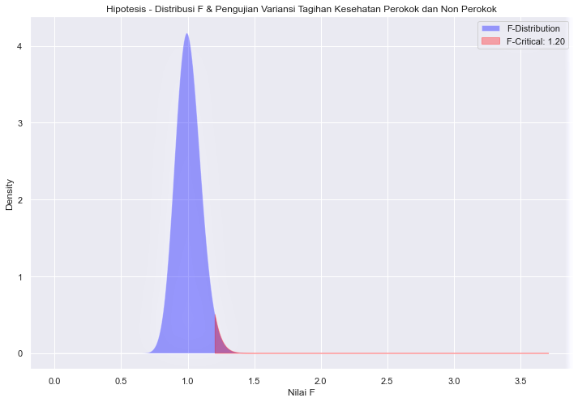

  :pushpin:Pengambilan Keputusan:

  - Tolak hipotesis nol (H0)
  - Variansi tagihan kesehatan perokok tidak sama dengan tagihan kesehatan non perokok

- Tagihan kesehatan dengan BMI diatas 25 lebih tinggi daripada tagihan kesehatan dengan BMI dibawah 25

        from scipy.stats import ttest_ind
        
        # Pisahkan data tagihan kesehatan antara BMI di atas 25 dan di bawah 25
        charges_bmi_diatas_25 = df[df['bmi'] > 25]['charges']
        charges_bmi_dibawah_25 = df[df['bmi'] <= 25]['charges']
        
        # Lakukan uji t-test independen
        t_statistic, p_value = ttest_ind(a=charges_bmi_diatas_25, b=charges_bmi_dibawah_25, equal_var=False, alternative='greater')

        # Visualisasi T-Distribution hipotesis tagihan kesehatan dengan BMI diatas 25 lebih tinggi daripada BMI dibawah 25
        
        # Hitung degree of freedom
        degree_of_freedom = len(charges_bmi_diatas_25) + len(charges_bmi_dibawah_25) - 2
        
        # Tingkat signifikansi yang umum: 0.05
        alpha = 0.05
        
        # Hitung critical value untuk alpha = 0.05
        t_crit = t.ppf(alpha, degree_of_freedom)
        
        # Visualisasi T-Distribution
        x = np.linspace(-5, 5, 1000)
        y = t.pdf(x, degree_of_freedom)
        
        # Area diatas kurva untuk t-critical
        plt.figure(figsize=(12, 8))
        plt.fill_between(x, y, label=f'T-Distribution', 
                            facecolor='blue',
                            alpha=0.35)
        
        # Tandai daerah kritis / Area dibawah kurva t-critical
        plt.fill_between(x, y, where=(x < t_crit), 
                         color='red', alpha=0.3, 
                         label=f'T-Critical: {round(t_crit, 2)}')
        
        # Tandai T-Statistic
        # plt.axvline(x=t_statistic, color='green', linestyle='--', label=f'T-Statistic {round(t_statistic, 2)}')
        
        plt.title('Hipotesis - Distribusi-T dengan T-Critical Tagihan Kesehatan BMI > 25 & BMI < 25')
        plt.xlabel('Nilai T')
        plt.ylabel('Density')
        plt.legend(loc='upper right')
        plt.show()
        
        # Tampilkan hasil uji
        print(f"T-Statistic : {t_statistic}")
        print(f"P-Value     : {p_value:.15f}")
        print(f"T-Critical  : {t_crit}")
        
        # Ambil keputusan berdasarkan p-value
        print("\nPengambilan Keputusan:")
        
        # Jika p_value lebih kecil dari alpha maka:
        if p_value < alpha:
            print("Tolak hipotesis nol (H0).")
            print("Tagihan kesehatan dengan BMI diatas 25 lebih tinggi daripada BMI dibawah 25.")
        # Jika p_value lebih besar dari alpha maka:
        else:
            print("Gagal tolak hipotesis nol (H0)")
            print("Tidak ada perbedaan signifikan antara tagihan kesehatan dengan BMI diatas 25 dan dibawah 25.")

      

  :pushpin:Pengambilan Keputusan:

  - Tolak Hipotesis nol (H0)
  - Tagihan kesehatan dengan BMI di atas 25 lebih tinggi daripada BMI di bawah 25
 
## Kesimpulan

Analisis Descriptive Statistic:

- Rata-rata umur pada dataframe adalah 39.22 tahun.
- Rata-rata BMI perokok adalah 30.71.
- Variansi tagihan perokok lebih besar dibanding non-perokok (133207311.21 vs. 35925420.50).
- Tidak ada perbedaan umur yang signifikan antara pria perokok dan wanita perokok.
- Rata-rata tagihan perokok jauh lebih besar dari rata-rata tagihan non-perokok.
- Rata-rata tagihan perokok yang BMI diatas 25 jauh lebih besar dari rata-rata tagihan non-perokok yang BMI diatas 25.
- Tidak ada perbedaan yang signifikan antara rata-rata BMI perokok dan BMI non-perokok.

Analisis Variabel Diskrit:

- Rata-rata tagihan kesehatan pria lebih besar dibandingkan wanita.
- Distribusi peluang tagihan tertinggi ada di region Southeast.
- Proporsi perokok lebih rendah daripada non-perokok.
- Peluang seorang perempuan adalah perokok sekitar 8.60%, sedangkan peluang seorang laki-laki adalah perokok sekitar 11.89%.
- Distribusi tagihan keempat region adalah Positively Skewed.

Analisis Variabel Kontinu:

- Peluang seseorang dengan BMI diatas 25 mendapatkan tagihan diatas 16.7k lebih besar daripada seseorang dengan BMI dibawah 25.
- Peluang perokok dengan BMI diatas 25 mendapatkan tagihan diatas 16.7k lebih besar daripada non-perokok.

Analisis Korelasi Variabel:

- Korelasi positif antara tagihan kesehatan dan BMI, tetapi hubungannya lemah.
- Korelasi positif antara tagihan kesehatan dan jumlah tanggungan anak, tetapi hubungannya lemah.

Pengujian Hipotesis:

- Terdapat perbedaan yang signifikan antara tagihan kesehatan perokok dan non-perokok (Tolak H0).
- Variansi tagihan kesehatan perokok tidak sama dengan tagihan kesehatan non-perokok (Tolak H0).
- Tagihan kesehatan dengan BMI di atas 25 lebih tinggi daripada tagihan kesehatan dengan BMI di bawah 25 (Tolak H0).

### *Kesimpulan Umum:*

- Tagihan kesehatan sangat dipengaruhi oleh kebiasaan merokok, BMI diatas 25, dan jenis kelamin.
- Rata-rata tagihan perokok lebih tinggi, dan variansinya juga lebih besar dibandingkan non-perokok.
- Individu dengan BMI diatas 25 cenderung memiliki tagihan kesehatan yang lebih tinggi.
- Hubungan antara tagihan kesehatan dengan umur dan jumlah tanggungan anak lemah.
- Diperlukan langkah-langkah pencegahan dan edukasi kesehatan, terutama pada kelompok risiko tinggi seperti perokok dan individu dengan BMI tinggi.

## Further Research

Berdasarkan analisis yang telah dilakukan, saran perbaikan dapat melibatkan fokus pada faktor-faktor yang signifikan memengaruhi tagihan kesehatan, seperti merokok, BMI diatas 25, dan jenis kelamin. Perluasan analisis dapat mencakup pemahaman lebih mendalam terkait faktor-faktor tersebut, mungkin dengan mempertimbangkan variabel tambahan atau memeriksa interaksi antar variabel. Selain itu, dalam mendalami korelasi, bisa dilakukan analisis lebih lanjut untuk mengevaluasi hubungan potensial antara variabel kesehatan dan variabel lainnya seperti gaya hidup dan riwayat kesehatan. Implementasi langkah-langkah pencegahan dan kampanye edukasi kesehatan dapat direkomendasikan, khususnya untuk kelompok risiko tinggi seperti perokok dan individu dengan BMI tinggi.

## Reference

LMS Pacmann - Probability

>### Terima kasih telah meluangkan waktu untuk membaca tulisan ini.
>
> Saya sedang belajar menulis, dan jika ada kesalahan maka tidak mungkin bisa saya dihindari bahkan ketika saya sudah berusaha sekuat tenaga. Silakan berikan feedback dan rekomendasi. Beri tahu saya jika Anda menemukan kesulitan atau kesalahan
  
      
      
